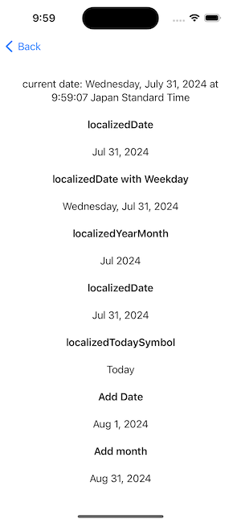
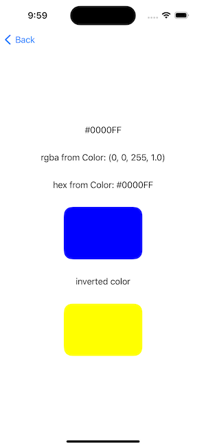
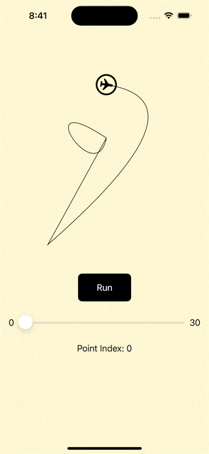

# Swift Useful Extensions

## Table of Contents

- [Date Extension](#date-extensions)
- [Color Extension](#color-extensions)
- [Path Extension](#path-extensions)


------
## Date Extensions
Formatting date to localized strings using Template and styles.
- [Extension](/SwiftExtensionCheatSheet/Extension/Date+Extension.swift)
- [Demo View](/SwiftExtensionCheatSheet/DemoView/DateExtensionDemo.swift)


Example Usage<br>
```
let date = Date()
let dateFormatter = DateFormatter()

var template = "yMMM"
dateFormatter.dateFormat = DateFormatter.dateFormat(fromTemplate: template, options: 0, locale: Locale(identifier: "en_US"))
print(dateFormatter.string(from: date)) //Apr 2024

dateFormatter.dateStyle = .full
dateFormatter.timeStyle = .full
dateFormatter.locale = Locale(identifier: "ja_JP")
print(dateFormatter.string(from: date)) //2024年4月16日 火曜日 10時20分14秒 日本標準時
```
<br>



For further details, check out [Swift: Working with Date](https://blog.stackademic.com/swift-working-with-date-this-is-all-we-need-to-know-2c17eb3a19b7).


## Color Extensions
From/To rgb, hex Int, and hex string, and calculate inverted color.
- [Extension](/SwiftExtensionCheatSheet/Extension/UIColor+Extension.swift)
- [Demo View](/SwiftExtensionCheatSheet/DemoView/ColorExtensionDemo.swift)


Example Usage<br>
```
let colorString = "#0000FF"
let color = UIColor(hex: Self.colorString) ?? .clear
let rgba = color.rgba ?? ""
let hex = color.hex(includeAlpha=true) ?? ""
```
<br>



For further details, check out [Swift: Working with Colors](https://medium.com/gitconnected/swift-working-with-colors-356f28a0e10b).


## Path Extensions
Retrive startpoint, element count of a Path. Get all points and tangents on a Path.
- [Extension](/SwiftExtensionCheatSheet/Extension/Path+Extensions.swift)
- [Animation along Path using extension](/SwiftExtensionCheatSheet/DemoView/AnimationAlongPath.swift)


Example Usage<br>
```
let path = Path { path in
    path.move(to: CGPoint(x: 100, y: 200))
    path.addQuadCurve(to: CGPoint(x: 90, y: 400), control: CGPoint(x: 500, y: 130))
    path.addLine(to: CGPoint(x: 200, y: 500))
    path.addCurve(to: CGPoint(x: 300, y: 100), control1: CGPoint(x: 50, y: 100), control2: CGPoint(x: 180, y: 300))
        path.closeSubpath()
}
let points = path.points(pointsPerElement: 10)
let pointsWithTangents = path.pointsWithTangents(pointsPerElement: 10)
```
<br>



For further details, check out
- [SwiftUI: Working with Path]()
- [SwiftUI: Animation Along Path 2 Ways]()